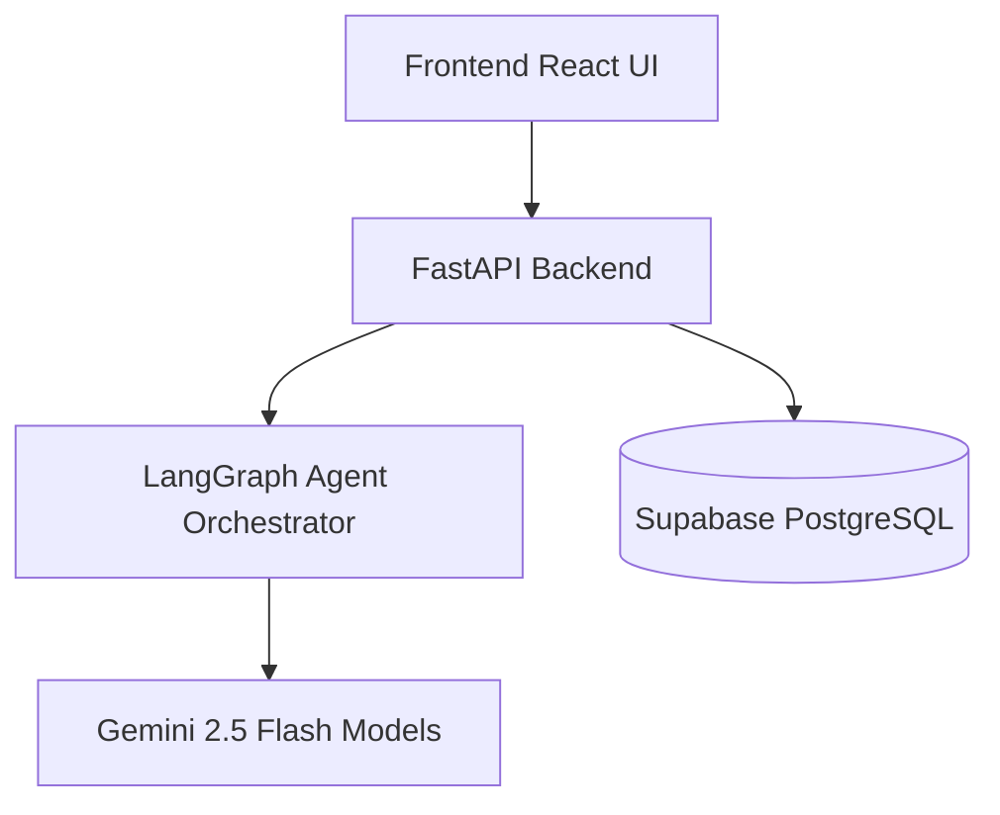

  
  <h1>🌍 AI-Powered Multi-Agent Travel Intelligence System</h1>
  
<em>An intelligent travel assistant that helps users plan trips, make group travel decisions, and adapt itineraries using a robust multi-agent architecture.</em>

The system combines **AI reasoning, collaborative decision-making, and real-time itinerary optimization** to provide a seamless, premium travel planning experience.

---

## ⚡ Tech Stack

**Frontend**
* ⚛️ React & Vite - Modern component-based UI with fluid Framer Motion animations
* 🔐 Supabase Authentication - Secure and seamless login

**Backend**
* 🐍 FastAPI (Python) - High performance asynchronous server
* 🤖 Modular AI Agent Architecture - REST APIs for travel planning services

**AI Layer**
* ✨ Gemini 2.5 Flash - For high-speed, intelligent generation
* 🕸️ LangGraph Orchestration - Multi-agent collaboration

**Database**
* 🐘 Supabase (PostgreSQL) - Reliable data and auth storage

---

## 🧠 Core AI Agents

Our system utilizes specialized AI agents working together in a **LangGraph pipeline**:

1. **Chatbot Agent** 💬 – Conversational travel assistant capturing nuanced preferences
2. **PackVote Agent** 🗳️ – Group travel decision intelligence for solving destination stalemates
3. **Disruption Recovery Agent** ☔ – Acts proactively to handle itinerary disruptions
4. **Multimodal Agent** 📸 – Supports image-based travel discovery
5. **Regret Score Agent** 📉 – Learns from past trips to optimize future satisfaction

---

## ✨ Key Features

- **AI-Powered Itinerary Generation:** Tailored day-by-day plans based on vibe, group type, and destination.
- **Collaborative PackVote:** Stop fighting over where to go; let AI find the perfect middle ground.
- **Regret Score Analysis:** Learn from "what went wrong" to enhance algorithmic suggestions.
- **Dynamic Micro-Interactions:** A beautiful, responsive interface designed to feel premium.

---

## 🏗️ System Architecture

---

## 🚀 Future Improvements

* 🛩️ **Real-time API integrations** (Flights, Hotels booking systems)
* 📱 **Mobile application release** (React Native)
* 🎯 **Reinforcement Learning** for deeper itinerary personalization

---

### Author
🎓 **Mahipatel** - Final Year Thesis Project
